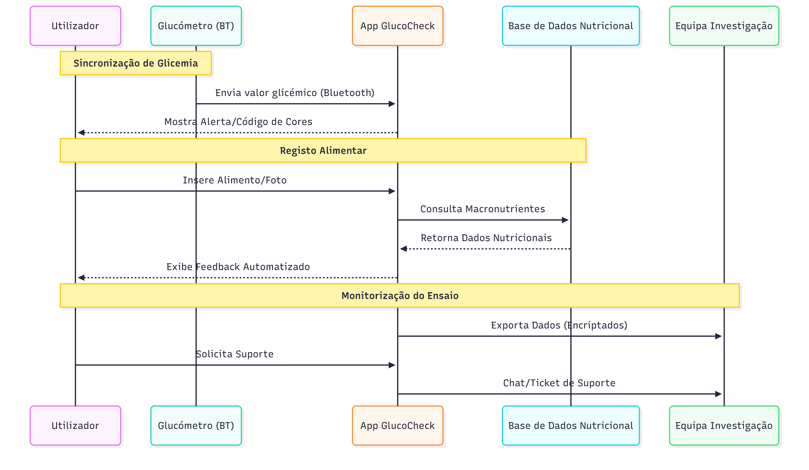

Nesta página encontram-se os recursos utilizados durante o desenvolvimento do projeto GlucoCheck.

## Diagramas

### Diagrama de Atividades

Diagrama do percurso do paciente no estudo clínico

%20(1).png){width="304"}

Diagrama do percurso como utilizador da aplicação digital

%20(1).png){width="452"}

### Diagrama de Casos de Uso

-01.png)

### Diagrama de Sequências

## Recolha e gestão de Dados

A gestão de dados do ensaio Glucocheck foi desenhada para garantir a integridade e segurança da informação clínica.

### CRF (Case Report Form)

O formulário de recolha de dados foi estruturado para capturar todas as variáveis essenciais do protocolo SPIRIT.

-   <a href="data/CRF.pdf" target="_blank">📄 CRF no formato PDF </a>

### Dicionário de Dados

O dicionário de dados define a estrutura da base de dados do ensaio, detalhando o significado de cada variável, os formatos de codificação e as regras de validação para garantir a qualidade da análise estatística.

-   
 <a href="data/dados.csv" download>📊 Descarregar Dicionário de Dados (CSV)</a>

### Plataforma REDCap

Para a entrada de dados eletrónica (eCRF), utilizou-se a plataforma **REDCap** (Research Electronic Data Capture), alojada nos servidores da FMUP.

-   \[Aceder ao Projeto no REDCap\] ([https://redcap.med.up.pt/...](https://redcap.med.up.pt/redcap/surveys/?s=D9FAKWHAHNH9MXHA))

## Protótipo

-   \[🔗 Visualização do protótipo no Figma\]([https://www.figma.com/proto/M5mClSPCalkSuboRTm7FJh/Untitled?node-id=1-44&t=3c78lYErSsrurPl4-1](https://www.figma.com/proto/M5mClSPCalkSuboRTm7FJh/GlucoCheck?node-id=1-44&t=3c78lYErSsrurPl4-1))
