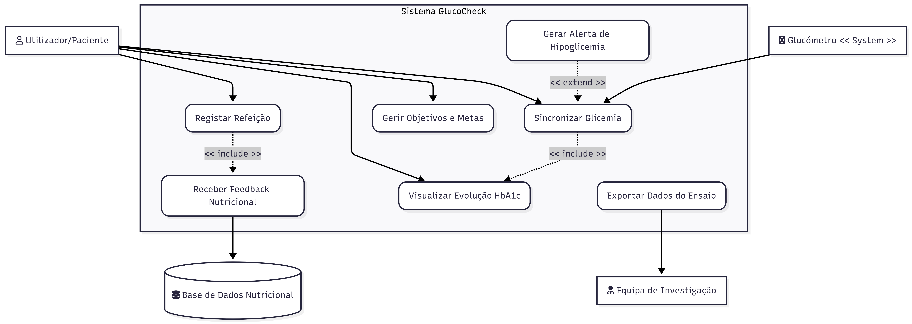

Nesta página encontram-se os recursos utilizados durante o desenvolvimento do projeto GlucoCheck.

## Diagramas

### Diagrama de Atividades

Diagrama do percurso do paciente no estudo clínico

 (1).png){width="304"}

Diagrama do percurso como utilizador da aplicação digital

 (1).png){width="452"}

### Diagrama de Casos de Uso

{width="811"}

### Diagrama de Sequências

## Recolha e gestão de Dados

A gestão de dados do ensaio Glucocheck foi desenhada para garantir a integridade e segurança da informação clínica.

### CRF (Case Report Form)

O formulário de recolha de dados foi estruturado para capturar todas as variáveis essenciais do protocolo SPIRIT.

[📄 Visualizar Modelo do CRF (PDF)](data/CRF.pdf)

### Plataforma REDCap

Para a entrada de dados eletrónica (eCRF), utilizou-se a plataforma \*\*REDCap\*\* (Research Electronic Data Capture), alojada nos servidores da FMUP.

-   **Segurança:** Acesso restrito via autenticação institucional.

-   **Validação:** Implementação de regras de \*data quality\* para evitar erros de preenchimento.

\[Aceder ao Projeto no REDCap\] ([https://redcap.med.up.pt/...](https://redcap.med.up.pt/redcap/redcap_v17.0.3/index.php?pid=109))

## Protótipo

-   \[🔗 Visualização do protótipo no Figma\]([https://www.figma.com/proto/M5mClSPCalkSuboRTm7FJh/Untitled?node-id=1-44&t=3c78lYErSsrurPl4-1](https://www.figma.com/proto/M5mClSPCalkSuboRTm7FJh/GlucoCheck?node-id=1-44&t=3c78lYErSsrurPl4-1))
